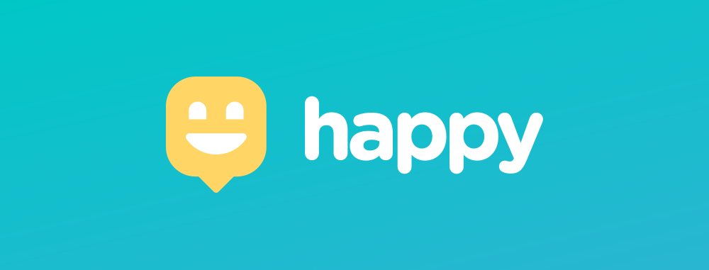

<h1 align="center">
    
</h1>

   

  <a href="#bookmark-sobre">Sobre</a>&nbsp;&nbsp;&nbsp;|&nbsp;&nbsp;&nbsp;
  <a href="#rocket-tecnologias">Tecnologias</a>&nbsp;&nbsp;&nbsp;|&nbsp;&nbsp;&nbsp;
  <a href="#-layout">Layout</a>&nbsp;&nbsp;&nbsp;|&nbsp;&nbsp;&nbsp;
  <a href="#memo-licença">Licença</a>

## :bookmark: Sobre

O **Happy** é uma aplicação para levar felicidade através da disponibilização de casas de acolhimento institucional. Nele você encontra as informações necessárias para tornar o dia de uma criança mais feliz 💜

## 🔖 Layout

Layouts do projeto disponíveis nos links. Para acessar, crie uma conta no [Figma](http://figma.com/).
- [Layout Web](https://www.figma.com/file/mDEbnoojksG4w8sOxmudh3/Happy-Web)
- [Layout Mobile](https://www.figma.com/file/X27FfVxAgy9f5IFa7ONlph/Happy-Mobile)

## 🚀 Tecnologias

-  [Yarn](https://yarnpkg.com/)
-  [ReactJS](https://reactjs.org/)
-  [Node.js](https://nodejs.org/en/)
-  [React Native](http://facebook.github.io/react-native/)
-  [Expo](https://expo.io/)
-  [Typescript](https://www.typescriptlang.org/)

<h4>Feito com ♥ by Victor Hugo :wave:</h4>

Projeto desenvolvido durante a NLW3/Omnistack com [Diego Fernandes](https://github.com/diego3g) da [Rocketseat](rocketseat.com.br).

## :memo: Licença

Esse projeto possui a licença MIT. Veja no arquivo [LICENSE](LICENSE.md) para mais informações.